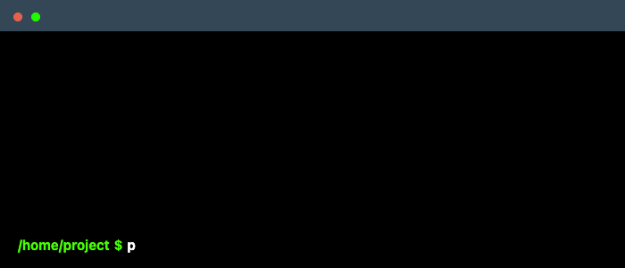

# AuthenticationX 💫

<p align="center">
<a href="https://authx.yezz.me" target="_blank">
    
</a>
<p align="center">
    <em>Ready-to-use and customizable Authentications and Oauth2 management for FastAPI ⚡</em>
</p>
<p align="center">
<a href="https://github.com/yezz123/authx/actions/workflows/test.yml" target="_blank">
    
</a>
<a href="https://pypi.org/project/authx" target="_blank">
    
</a>
<a href="https://codecov.io/gh/yezz123/authx">
    
</a>
<a href="https://pepy.tech/project/authx" target="_blank">
    
</a>
</p>
</p>

---

**Source Code**: <https://github.com/yezz123/authx>

**Documentation**: <https://authx.yezz.me/>

---

Add a Fully registration and authentication or authorization system to your
[FastAPI](https://fastapi.tiangolo.com/) project. **AuthX** is designed to be as
customizable and adaptable as possible.

## [Authx V0.9.x](https://authx-v0.yezz.me/)

This branch relates to development of authx V1 which is not yet ready for production use.

If you're a Authx user, you probably want either Authx V0.9 [Documentation](https://authx-v0.yezz.me/) or, [0.X.X-fix](https://github.com/yezz123/authx/tree/0.X.X-fix) git branch.

## Installation 📦



## Features 🔧

- [x] Support Python 3.9+.
- [x] Multiple customizable authentication backend:
  - [x] JWT authentication backend included
    - [x] JWT encoding/decoding for application authentication
    - [x] Automatic detection of JWTs in requests:
      - [x] JWTs in headers
      - [x] JWTs in cookies
      - [x] JWTs in query parameters
      - [x] JWTs in request bodies
  - [x] Cookie authentication backend included
- [x] middleware for authentication and authorization through JWT.
- [x] Extensible Error Handling System.
- [x] Using Redis as a session store & cache.
- [x] Support HTTPCache.
- [x] Support Sessions and Pre-built CRUD functions and Instance to launch Redis.
- [x] Support Middleware of [pyinstrument](https://pyinstrument.readthedocs.io/) to check your service performance.
- [x] Support Middleware for collecting and exposing [Prometheus](https://prometheus.io/) metrics.

**Note:** Check [Release Notes](https://authx.yezz.me/release/).

## Project using 🚀

Here is a simple way to kickstart your project with AuthX:

```python
from fastapi import FastAPI, Depends, HTTPException
from authx import AuthX, AuthXConfig, RequestToken

app = FastAPI()

config = AuthXConfig(
     JWT_ALGORITHM = "HS256",
     JWT_SECRET_KEY = "SECRET_KEY",
     JWT_TOKEN_LOCATION = ["headers"],
)

auth = AuthX(config=config)
auth.handle_errors(app)

@app.get('/login')
def login(username: str, password: str):
     if username == "xyz" and password == "xyz":
          token = auth.create_access_token(uid=username)
          return {"access_token": token}
     raise HTTPException(401, detail={"message": "Invalid credentials"})

@app.get("/protected", dependencies=[Depends(auth.get_token_from_request)])
def get_protected(token: RequestToken = Depends()):
     try:
          auth.verify_token(token=token)
          return {"message": "Hello world !"}
     except Exception as e:
          raise HTTPException(401, detail={"message": str(e)}) from e
```

## Links 🚧

- [Homepage](https://authx.yezz.me/)
- [FAQ](https://authx.yezz.me/faq/)
- [Release - AuthX](https://authx.yezz.me/release/)
- [MIT License](https://authx.yezz.me/license/)
- [Code of Conduct](https://authx.yezz.me/code_of_conduct/)
- [Contributing](https://authx.yezz.me/contributing/)
- [Help - Sponsors](https://authx.yezz.me/help/)

## License 📝

This project is licensed under the terms of the MIT License.
